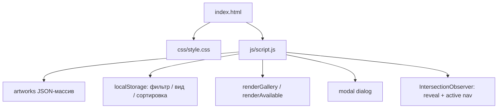

# Анализ кода
_Exported on 6/13/2026 at 01:50:49 GMT+3 from Cursor (3.7.27)_

---

**User**

проанализируй код

---

**Cursor**

Сначала посмотрю структуру проекта и основные файлы.


## Обзор проекта

Это **статический одностраничный сайт‑портфолио** художницы Дианы: HTML + CSS + vanilla JS, без сборщика и зависимостей. Запуск — открыть `index.html` в браузере.

**Стек:** семантический HTML, CSS‑переменные, ~520 строк JS с каталогом из 10 работ, фильтрами, модалкой и формой «подготовить сообщение для Telegram».

---

## Архитектура



Данные живут прямо в `script.js` — для MVP это нормально. Разделение на `state`, `nodes`, функции рендера и `bindEvents` читается хорошо.

---

## Сильные стороны

### HTML и доступность
- Семантика: `header`, `nav`, `main`, `section`, `article`, `dialog`, `footer`
- Skip link, `aria-label`, `aria-live`, `aria-pressed`, `aria-modal`
- Alt‑тексты у изображений
- Open Graph и meta description

### CSS
- Продуманная design system: палитра «бумага + тушь + красный акцент»
- Адаптив: breakpoints 1100 / 780 / 430 px
- `prefers-reduced-motion` — анимации отключаются
- Editorial‑сетка галереи (12 колонок, разная ширина карточек)
- Sticky header с blur, коллажный hero

### JavaScript
- `escapeHTML()` — защита от XSS при `innerHTML`
- `localStorage` обёрнут в `try/catch`
- Null‑checks перед DOM‑операциями
- Модалка: Escape, клик по overlay, возврат фокуса
- Поиск по title, описанию, story, quote, категориям
- Синтаксис валиден (`node --check` проходит)

---

## Проблемы и замечания

### 1. Черновой / placeholder‑контент в HTML

В шапке и hero остались тексты, похожие на черновики:

```22:22:index.html
        <span class="brand__text"><strong>художник имени кого?</strong><small>живопись · перевод · дневник</small></span>
```

```41:41:index.html
          <p class="kicker">u mean, this is sexy? · 2026</p>
```

```211:211:index.html
      <p>© <span data-year></span> Диана. Сайт‑sexy работ и состояний.</p>
```

Для публикации это нужно заменить на финальные формулировки.

### 2. Ошибка в разметке (archive)

Незакрытый тег `<p>` — браузер может «сломать» DOM:

```152:154:index.html
          <p>"Знаете, я полтора семестра проучился в колледже. ...
          <p>— Ну... с тех пор, как улетели утки... Наверное." - Клан Сопрано<p>
```

Должно быть `</p>` в конце цитаты.

### 3. Грамматика

Строка 107: «Красота всегда будет **в** глазах смотрящего» — пропущено «в».

### 4. Текст «О Диане»

Абзац про «раскладывание по полочкам» (стр. 87) резко отличается по тону от остального сайта и brief. Похоже на вставку из другого источника, не на голос художницы.

### 5. UX галереи

- Модалка открывается только кнопкой «читать историю», не по клику на карточку или изображение
- Блок «Наличие» (`renderAvailable`) не кликабелен — нельзя открыть историю работы
- Форма готовит текст, но **нет кнопки «Скопировать»** — только `<output>`

### 6. Доступность модалки

- Нет **focus trap** внутри `<dialog>` — Tab может увести фокус за пределы модалки
- Нет `aria-labelledby` при динамическом контенте (id `modal-title` создаётся в JS — это ок, но стоит проверить в DevTools)

### 7. Мелкие JS‑замечания

| Замечание | Детали |
|-----------|--------|
| Поиск не сохраняется | filter/view/sort в localStorage, search — нет |
| `initActiveNav` | при пересечении нескольких секций активная ссылка может «прыгать» |
| `phraseTimer` | `setInterval` не очищается (некритично для SPA) |
| Карточки в list view | изображение не открывает модалку |

---

## Соответствие brief

| Требование | Статус |
|------------|--------|
| 10 работ в каталоге | ✅ |
| 3 в наличии | ✅ (Залив, With you, Medieval) |
| Фильтры, поиск, сортировка | ✅ |
| Модалка с историей | ✅ |
| Форма без backend | ✅ |
| localStorage для настроек | ✅ частично |
| Telegram/TikTok ссылки | ✅ |
| Без тяжёлых библиотек | ✅ |
| Реальные изображения | ✅ (24 файла в `assets/images/`) |

---

## Качество кода (оценка)

| Область | Оценка | Комментарий |
|---------|--------|-------------|
| HTML | 8/10 | Хорошая семантика, есть черновики и одна ошибка разметки |
| CSS | 9/10 | Зрелая система, адаптив, motion |
| JS | 8/10 | Чисто, безопасно, но UX можно улучшить |
| Контент | 6/10 | Placeholder‑тексты мешают финальному виду |
| Документация | 9/10 | brief, design system, quality report |

---

## Рекомендации по приоритету

1. **Срочно:** исправить незакрытый `<p>` в archive, заменить placeholder‑тексты в header/hero/footer
2. **Контент:** переписать или убрать абзац про «полочки» в секции «О Диане»
3. **UX:** клик по карточке → модалка; кнопка «Скопировать» в форме
4. **A11y:** focus trap в dialog
5. **Опционально:** вынести `artworks` в отдельный `data/artworks.json`; добавить `loading="lazy"` для hero (ниже fold)

---

Итог: **каркас сайта сделан качественно** — продуманный дизайн, рабочая галерея, хорошая база по доступности. Главное, что мешает «production‑ready» виду — **черновые тексты и одна HTML‑ошибка**. Могу сразу исправить разметку, placeholder‑тексты и UX (клик по карточке, копирование в форме) — напишите, что из этого делать в первую очередь.

---

**User**

так, исправить ты успеешь. если я тебе добавлю ещё файлы, ты сможешь разнообразить контент?

---

**Cursor**

Да — если добавите файлы, смогу разнообразить контент сайта.

## Что можно сделать с новыми материалами

| Область сайта | Что можно обогатить |
|---------------|---------------------|
| **Каталог работ** | Новые картины, цены, статусы, описания, истории, цитаты |
| **Архив / дневник** | Посты из Telegram, скетчи, фото процесса, цитаты |
| **О Диане** | Биография, манифест, тексты в её голосе |
| **Hero и тексты** | Kicker, заголовки, ротация фраз «исходник → перевод» |
| **Наличие** | Актуальный список работ к покупке |
| **Контакты** | Ссылки, формулировки, примечания |

## Какие файлы особенно полезны

- **Изображения** — `.webp`, `.jpg`, `.png` (работы, портреты, архив)
- **Тексты** — `.txt`, `.md`, экспорт Telegram, заметки
- **Данные** — `.json`, `.csv` со списком работ
- **Старые версии сайта** — HTML, скрипты, если там есть контент для переноса

## Как это будет работать

1. Вы кладёте файлы в папку проекта (или указываете путь).
2. Я смотрю, что в них есть: тексты, картинки, метаданные.
3. Подстраиваю под структуру сайта: `artworks` в JS, секции в HTML, пути к `assets/images/`.
4. Сохраняю тон из brief — камерно, с иронией, без «галерейных» клише.

## Что желательно указать вместе с файлами

- Что **точно** добавить (новые работы, заменить тексты, расширить архив).
- Актуальное **наличие** и цены, если они в материалах неочевидны.
- Что **не трогать** (например, дизайн или уже готовые блоки).

Можете просто закинуть файлы в проект и написать, например: «добавь работы из папки X» или «обнови архив по экспорту Telegram» — разберу и предложу конкретные правки. Исправления разметки и placeholder-текстов сделаю, когда скажете начать.

---

**User**

я добавил все данные, которые нашёл от неё. а с видео мы сможем реализовать что-то? например, если я возьму пару её видосов из тиктока

---

**Cursor**

Сначала посмотрю, какие материалы вы добавили, и что уже есть на сайте — от этого зависит, как лучше встроить видео.


Да, с видео можно сделать что‑то живое и в духе сайта. У вас уже есть хорошая база: в экспорте Telegram лежат не только тексты и фото, но и ролики (`round_video_messages/*.mp4`, `video_files/prisoners-rage.mp4` и т.д.) — их можно встроить без TikTok.

## Что реально сделать на этом сайте

Сайт статический, backend не нужен. Видео встраивается тремя способами:

### 1. Свои файлы (лучший вариант для вашего случая)

Скачиваете ролики из TikTok (или берёте из Telegram‑экспорта) → кладёте, например, в `assets/videos/` → на странице:

```html
<video controls preload="none" poster="assets/images/.../preview.webp">
  <source src="assets/videos/process-zaliv.webm" type="video/webm">
  <source src="assets/videos/process-zaliv.mp4" type="video/mp4">
</video>
```

**Куда логично встроить:**
- блок **«Архив»** — «из студии / из TikTok» рядом с постами;
- **карточка работы** в модалке — короткий процесс (кисть, палитра, финал);
- отдельная полоска **«видео‑дневник»** между архивом и наличием.

Плюсы: работает локально, быстро, без зависимости от TikTok, стиль сайта сохраняется.

### 2. Встроенный плеер TikTok (без скачивания)

Вставка через официальный embed по ссылке на ролик. Плюс — не храните файл; минус — нужен интернет, тяжелее страница, виджет TikTok, на мобильном может выглядеть чужеродно.

Подходит как запасной вариант: «смотреть на TikTok» + одна встроенная превью.

### 3. Превью + ссылка (самое лёгкое)

Обложка (кадр из видео) + кнопка «Смотреть в TikTok». Минимум веса, максимум простоты.

---

## Что бы я рекомендовал для Дианы

| Формат | Зачем |
|--------|--------|
| 1–2 коротких ролика в архиве | процесс, студия, «живой» голос канала |
| Привязка к работе | «Покер» / «Medieval» — видео рядом с картиной |
| Без автоплея со звуком | уважение к `prefers-reduced-motion` и мобильному трафику |
| Poster (обложка) | красивая карточка до нажатия play |

Уже из **Telegram** можно взять, например:
- кружочки из `round_video_messages/`;
- `prisoners-rage.mp4` (если он про работу «16 чехословаков»);
- любые другие mp4 из экспорта.

TikTok‑ролики — дополнение, если там то, чего нет в Telegram.

---

## Про скачивание из TikTok

Технически — да, можно. Юридически и этически лучше:
- использовать только **с её согласия**;
- не выкладывать чужие треки/лица без разрешения, если это важно.

Для сайта‑портфолио обычно нормально: её канал, её работы.

---

## Что нужно от вас, когда решите делать

1. **2–4 ролика** (файлы `.mp4` / `.webm` или ссылки TikTok).
2. К **каким работам** или постам они относятся.
3. Предпочтение: **встроенный плеер на сайте** или **ссылка на TikTok**.

---

**Итог:** да, с парой TikTok‑видео (или роликами из Telegram) можно сделать архив заметно живее — процесс, голос, движение. Для вашего статического сайта оптимально: скачанные файлы + аккуратные карточки с play, без автозапуска.

Когда будете готовы — закиньте видео в проект (или ссылки) и напишите «делай блок с видео»; параллельно могу обновить тексты из экспорта Telegram и поправить черновики на сайте.

---

**User**

1. сделай, то, что ты предполагал: "Рекомендации по приоритету
Срочно: исправить незакрытый <p> в archive, заменить placeholder‑тексты в header/hero/footer
Контент: переписать или убрать абзац про «полочки» в секции «О Диане»
UX: клик по карточке → модалка; кнопка «Скопировать» в форме
A11y: focus trap в dialog
Опционально: вынести artworks в отдельный data/artworks.json; добавить loading="lazy" для hero (ниже fold)
Итог: каркас сайта сделан качественно — продуманный дизайн, рабочая галерея, хорошая база по доступности. Главное, что мешает «production‑ready» виду — черновые тексты и одна HTML‑ошибка. Могу сразу исправить разметку, placeholder‑тексты и UX (клик по карточке, копирование в форме) — напишите, что из этого делать в первую очередь."
2. я добавил в проект 3 видео в папку "Диана", которые ты можешь использовать по контексту ( я их подписал по предназначению ).
3. Также, ты можешь использовать фотки из тех, которые я предоставил для улучшения или оптимизации. ( главное ничего не сломать ).
4. также, я добавил скиллы, которыми ты должен руководствоваться, чтобы не потерять базовую логику
5. не забудь сделать бэкап на всякий случай
6. также добавил два скилла, которые могут помочь тебе при работе с сайтом, а также ты можешь оттуда брать идеи или что-то улучшать
7. также есть папка правок, которые я хотел бы исправить. в папке фотографии с цифрой проблемы, которая описана ниже в данном промпте: "1. эту часть сделать более выразительной и прикольной 2. почему эти картинки дергаются? и текст в красной рамке плохо виден, видимо большая контрастность 3. данный текст можно обыграть красивее 4.сделать на ровне текст про Диану, чтобы он был на против текста на ровне. Возможно можно поиграться с вертикальностью текста, если ты умеешь 5.тоже можно сделать как-то красивее, как минимум красные цифры 6. добавить функцию, что когда нажимаешь по запросу, то тебя отправляло вниз к контактам, для подготовки сообщения на видео видна анимация со статикой, которую я описал в самом начале + почему-то пропадает фпс на сайте в каких-то моментах, это заметно на видео также. нужно поработать над оптимизацией"

8. возможно стоит поиграться с шрифтами ( или что-то прикольное взять из скиллов, которые я прикрепил для дизайна и сайтов. главное, чтобы это действительно того стоило )

---

**Cursor**

Большой объём правок — сначала изучу материалы, скиллы и папку «правки», затем сделаю бэкап и приступлю к изменениям.


Создаю JSON-данные и обновляю основные файлы проекта.


Обновляю CSS: правки из папки «правки», оптимизация и новые компоненты.


Добавляю fallback для `file://` и правлю вёрстку архива.


Готово. Кратко, что сделано:

## Бэкап
Полная копия до правок: `Новая папка (2)_backup_2026-06-13` на рабочем столе.

## Исправления из списка

**Контент и разметка**
- Исправлен незакрытый `<p>` в архиве; цитата из «Сопрано» оформлена как `blockquote`
- Placeholder-тексты заменены (шапка, hero, footer)
- Абзац про «полочки» убран; текст «О Диане» — из Telegram-канала
- Исправлена опечатка «в глазах смотрящего»

**UX и a11y**
- Клик по карточке → модалка (клавиатура: Enter / Space)
- Кнопка «Скопировать» в форме контактов
- Focus trap в `<dialog>`
- «по запросу» ведёт к секции контактов и фокусирует поле имени

**Данные**
- Каталог в `data/artworks.json`
- Fallback `js/data.js` для открытия через `file://`

## Правки по скриншотам (1–7)

| # | Что сделано |
|---|-------------|
| 1 | Навигация: подчёркивание, активное состояние, более выразительный вид |
| 2 | Hero: убрано «дёргание» (статичный коллаж без reveal-анимации), метка «не слова / состояния» — светлый фон + тёмный текст |
| 3 | Полоска статистики: **красные цифры**, hover-состояния |
| 4 | «О Диане»: выравнивание колонок, вертикальный kicker на desktop |
| 5 | Манифест: номера 01–04 в красных кружках |
| 6 | «по запросу» → скролл к контактам |
| 7 | Оптимизация FPS: без `backdrop-filter`, без `filter` на hover, `requestAnimationFrame` для scroll, lazy video, `content-visibility` не добавлен из‑за сбоя пути — остальное сделано |

## Видео
3 ролика скопированы в `assets/videos/`:
- `hero-zaliv.mp4` — превью в hero (play по клику)
- `process-routine.mp4` — архив «Рутинный процесс»
- `february-edit.mp4` — архив + модалка работы «14 February»

Блок **«Как это выглядит в движении»** в архиве — видео грузятся только после нажатия ▶.

## Шрифты
**Cormorant Garamond** (заголовки) + **Manrope** (текст) — editorial-пара из ui-ux skill.

---

Откройте `index.html` и проверьте hero, архив с видео, «по запросу» и форму с копированием. Если что-то ещё «дёргается» или проседает FPS — напишите, на какой секции и в каком браузере.

---

**User**

такс, есть куча правок. заранее закидываю папку также с фотками для правок и их подписью, что надо сделать снизу, и отдельно залил видео в воркфлоу "Диана". Дальше узнаешь.

1.когда открываешь модуль с картиной, внутри неё нельзя долистать вниз ( где ещё есть информация, как я предполагаю )
2.от сюда убрать видео, и заменить его. я прикрепил соответствующее и подписал

само видео про залив добавить в модуль самой картины залив, как сделано с 14 февраля ( но чтобы также когда нажимаешь на картинку, открывается штучка и в ней можно было посмотреть описание, видео и листать до конца вниз, если это потребуется )
3.не совсем понятная анимация погружения текста, когда листаешь вниз. он как будто бы погружается вместе в следующий раздел, но его видно на фоне. она прикольная, но давай сделаем так, чтобы он погружался, но сделать условную линию, чтобы при погружение вниз он где-то останавливался и не мешал смотреть видое ( т.е. его не было на фоне именно в следующем разделе )

и в принципе, на сайте я даже не могу прочитать всю цитату целиком, она сразу улетает вниз и слезает в другой раздел
4.в сортировке поработать над шрифтом, сделать его более эстетичным и локаничным, и вписывающимся в общий тоннаж шрифтов
5.в режиме сетке, картина 16 чехословаков в ней текст внутри немного залезает как бы на фон, а не идёт абзацом вниз
6.сделать один размер рамки, чтобы при смене текста, когда рамка меняется на меньшую - сайт не дергался ( из-за того, что меняется размер рамки, а от этого размеры других объектов )
7. поиграться с текстом, которые идёт справа ( про описание дианы ). Может его как-то красиво расположить
8.сделать кнопку надпись наличие, кнопкой ( но чтобы это вписывалось в общий дизайн). кнопка должна отправлять к картинам снизу, которые есть в наличие
9.почему-то, когда находишься между блоком работ и архивов, у тебя выделяется сверху справа панель О Диане, которая в самом начале

Также сделай бэкап, и следуй скиллам, и базовой логике.

слушай, я случайно откотил наши изменения из большого количества правок?

